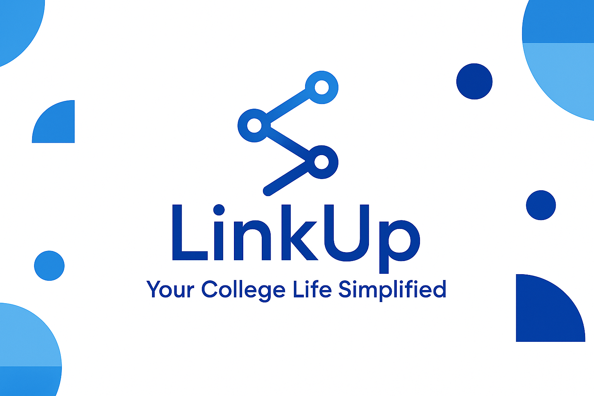

#  LinkUp - Your College Life Simplified

 <!-- You can replace this with your own banner image -->

> A modern, interactive platform for college students to connect, collaborate, and manage campus life with ease.

[🌐 Live Project](https://link-up-zeta.vercel.app/) &nbsp;&nbsp;|&nbsp;&nbsp; [💻 GitHub](https://github.com/Het2239/LinkUp) &nbsp;&nbsp;|&nbsp;&nbsp; [📇 LinkedIn](https://www.linkedin.com/in/het-chavadiya-a84312316/) &nbsp;&nbsp;|&nbsp;&nbsp; [📸 Instagram](https://www.instagram.com/het_6616/) &nbsp;&nbsp;|&nbsp;&nbsp; 

---

## 🌟 Motivation

Starting college can feel overwhelming — especially for freshers trying to find their tribe, keep up with academics, and stay updated on campus activities. **LinkUp** was born out of the idea of creating a **personal social app tailored specifically for colleges**, enabling students to:

- Collaborate on shared interests  
- Exchange academic resources  
- Stay informed and involved in campus life  
- Connect with peers, seniors, and student bodies  

I got the idea for LinkUp when I faced similar challenges myself — feeling lost, unsure of where to go for help, and wishing there was a single space where everything a student might need was just... there.  
At that time, I genuinely hoped the college had a platform where we could **easily find people to connect with, discover events, access resources, and feel like part of a community** from the very beginning.

I wanted to create something more meaningful than just a website — a platform where **students feel supported, welcomed, and empowered to build friendships and thrive socially and academically from day one**.

---

## 🎯 Objective

To design and develop a **modern and interactive** web platform where students can:

- Share travel plans and resources
- Collaborate on academic content
- Stay informed with campus updates
- Easily access mess/canteen menus and college contacts
- Build meaningful connections with fellow students

---

## 🧩 Key Features

### 🔐 Authentication System
- Separate login for **Students** and **Admins**
- **New Registration** portal for new users
- Secure password encryption
- Secure Password retriveal(i.e Forgot Password)
- Validations for user inputs

### 🚖 Taxi Search
- Post and join ride-share plans
- Real-time filters for destination/date/time
- Group communication via chat/comments

### 📚 Study Materials & Discussion
- Upload & access materials (categorized by subject/semester)
- Interactive discussion board

### ✉️ Mail Formats & Contact List
- Ready-to-use email templates
- Editable fields for personalization
- Contact directory for staff & admins

### 🧑‍🤝‍🧑 Know Your People
- Directory of key students & faculty members
- Role-based profiles

### 🌄 Outings & Trips
- Post and join college outings
- Upvote & comment on suggestions

### 📌 Notice Board
- Central hub for all campus news and updates
- Admin-controlled posting/editing

### 🍽️ Mess & Canteen Menu
- Daily mess menu (admin-controlled)
- Live canteen menu with prices

---

## 🎨 UI/UX Design Highlights

- 🌈 **Color Scheme:** Gradient-rich and student-friendly tones
- 🅰️ **Typography:** Clean and modern fonts (e.g., Montserrat, Poppins)
- ⚙️ **Interactive UI:** Hover effects, cards, animations
- 📱 **Responsive Design:** Works across devices
- 🧭 **Role-based Dashboards:** Different UIs for Students and Admins
- 🌙 **Dark/Light Mode Toggle**

---

## 🛠️ Technology Stack

### 🔧 Frontend
- HTML, CSS (TailwindCSS/Bootstrap), JavaScript

### 🧪 Backend
- SupaBase

### 🌍 Hosting
- **Frontend:** Vercel
- **Backend:** Supabase
- **Database:** Supabase Realtime DB

---

## 🚀 Future Advancements

### 🐦 Social Feed (Like Twitter)
We're planning to develop a **micro-social platform** within LinkUp where students can:

- Post short messages, ideas, or announcements  
- Like, comment, and repost  
- Follow other students for updates  
- Build **mini-communities within college**

This will further promote **interactions and collaborations**, particularly benefiting **freshers** looking to settle in and make friends.

### 🌐 Multi-College Support
In the future, **LinkUp will support students from any college** — not just one.  
The goal is to:

- Allow students from **any college** to register and use the platform  
- Ensure that **each college has its own isolated database**, keeping their internal discussions, events, and resources private  
- Enable college-specific social feeds and collaboration spaces  

This will scale LinkUp into a **personalized social experience for every campus**, while maintaining the integrity and privacy of each institution.

---

## 🔔 Optional Enhancements

- Push Notifications for updates & reminders
- QR Code Login using college ID
- AI Chatbot to handle common questions
- Event Calendar with RSVP feature

---

## 📆 Development Timeline

| Week | Task |
|------|------|
| 1-2  | UI/UX Wireframing & Frontend Setup |
| 3-4  | Backend Development & Database Integration |
| 5    | Fullstack Integration & Testing |
| 6    | Bug Fixes, Polishing & Deployment |

---

## 💡 Contribution Guidelines

Want to help improve LinkUp? We welcome contributions!

1. Fork the repo
2. Create a feature branch (`feature/my-awesome-feature`)
3. Commit your changes
4. Open a Pull Request with a clear description

---

## 🧑‍💻 Developers & Contributors

- **Het Chavadiya**  
  📧 [hetchavadiya@gmail.com](mailto:hetchavadiya@gmail.com)

---

